  
  <h1>
    <b>SHOVEL</b>
  </h1>
  

Powered by [hscsec](https://www.hscsec.cn)

⚠️ 声明

此项目正在积极开发中。预计新版本会引入突破性变更。更新前请务必查看版本更改日志。

如果您觉得项目对您有帮助，请给我们的项目一个[鼓励的星星⭐️](https://github.com/diamond-shovel/diamond-shovel)！

## 🔍 重新定义企业资产管理范式

**Shovel** 是一款面向现代企业安全团队的开源资产测绘平台。通过融合主被动扫描引擎、多模态数据关联分析和智能风险评估模型，我们致力于解放安全行业重复劳动者的双手、为企业提供更优雅的资产治理解决方案。

## ✨ 为什么选择shovel

| 特性维度     | 传统方案         | SHOVEL 解决方案        | 核心优势体现                             |
| ------------ | ---------------- | ---------------------- | ---------------------------------------- |
| **资产发现** | ❌ 被动式人工录入 | ✅ 主动+被动自动化发现  | 更全面：多平台资产自动发现，资产面覆盖完全 |
| **分析资产** | ❌ 缺乏系统管理，只关注单次任务   | ✅ 资产自动指纹分类，系统性管理资产组     | 更高效：自动构建资产关系网络             |
| **扩展能力** | ❌ 封闭式系统     | ✅ 开放式插件架构       | 更自由：API+插件灵活扩展                 |
| **架构设计** | ❌ 单体架构       | ✅ 核心与中间件分离架构 | 更灵活：支持分布式/边缘部署              |

## ⚡ 快速部署使用

### 一键部署

请参考[一键部署](./quick-start.md?id=一键部署流程)

## 🧩 插件生态系统

### 官方基础插件集（持续更新）

| 插件名称                | 功能描述                                                                 | 标签                                                                 |
|-------------------------|--------------------------------------------------------------------------|----------------------------------------------------------------------|
| **fingerprinter**       | 根据任务中的URL信息进行CMS指纹识别                                       | `info-collecting`, `collector`, `discovery`, `identification`, `CMS` |
| **nmapper**             | 根据任务中的Host信息，使用Nmap扫描器进行端口探测并识别服务               | `info-collecting`, `collector`, `network`, `nmap`, `port`, `discovery`, `CIDR` |
| **fofa_mapper**         | 根据任务中的域名信息，使用FOFA进行信息收集                               | `info-collecting`, `collector`, `domain`, `FOFA`                     |
| **http_port_visitor**   | 根据任务中的开放端口信息，进行相关Web服务的信息收集                      | `httpx`, `info-collecting`, `collector`, `ports`, `http`             |
| **company_investigator**| 根据任务中的公司/集团名进行ICP备案信息收集                               | `info-collecting`, `collector`, `company`, `enscan`, `unstable`      |
| **domain_seeker**       | 根据任务中的域名信息，进行子域名信息收集                                 | `info-collecting`, `collector`, `website`, `discovery`, `domain`, `DNS`, `amass` |
| **nuclei_reactor**      | 根据任务中的URL信息，使用Nuclei扫描器进行漏洞检测                        | `vulnerability`, `detection`, `nuclei`, `exploit`, `CVE`             |

* 更多社区插件: 插件商店建设中...

## 🌱 欢迎贡献插件

我们鼓励开发者参与插件生态建设：
1. **提交插件**：将你的插件代码提交到我们的插件市场
2. **插件审核**：经过审核后，优质插件将被纳入官方插件库
3. **社区奖励**：贡献者将获得专属荣誉标识和社区积分

## 📢 温馨提示

- **插件编写指南**：详细的插件开发Wiki将在近期发布，敬请期待！
- **插件反馈**：如果你对现有插件有任何建议或发现问题，欢迎提交[Issue](https://github.com/diamond-shovel/diamond-shovel/issues)

## 💡 核心文档

以下是 Shovel Core 的核心文档，主要面向插件开发者和需要深入了解 Shovel 内部机制的用户。
**请注意，如果您是普通用户，建议使用[快速部署](./quick-start.md)，无需阅读以下文档。**

*   [简易插件开发指南](https://github.com/diamond-shovel/diamond-shovel/blob/main/docs/plugin-dev.md)
*   [命令行版本安装指南](https://github.com/diamond-shovel/diamond-shovel/blob/main/docs/install.md)
*   [命令行调用手册](https://github.com/diamond-shovel/diamond-shovel/blob/main/docs/cmdline.md)

## 📕 项目结构

项目由`shovel_core`、`shovel-intermediate-layer`、`shovel-frontend`三个子层构成，具体组成如下图所示

```mermaid
graph TB
    subgraph Shovel Plugins
        shovel-plugin1[shovel-plugin-1]
        shovel-plugin2[shovel-plugin-2]
        shovel-pluginN[shovel-plugin-N]
    end

    subgraph Shovel Cores
        shovel-core1[shovel-core-1]
        shovel-core2[shovel-core-2]
        shovel-coreN[shovel-core-N]
    end

    subgraph Middleware
        shovel-db[shovel-db]
        other-middleware[其他中间件]
    end

    scheduler[scheduler]
    intermediate[shovel-intermediate-layer]
    frontend[shovel-frontend]
    nginx[nginx]
    workbench[shovel-workbench]

    shovel-plugin1 --> shovel-core1
    shovel-plugin2 --> shovel-core1
    shovel-pluginN --> shovel-coreN

    shovel-core1 --> scheduler
    shovel-core2 --> scheduler
    shovel-coreN --> scheduler

    scheduler --> intermediate
    shovel-db --> intermediate
    other-middleware --> intermediate

    intermediate --> nginx
    frontend --> nginx

    nginx --> workbench
```

### 关于前端 (`shovel-frontend`) 和中间层 (`shovel-intermediate-layer`) 代码

Shovel 项目的核心功能集中在 `shovel_core` 中。用户可以通过编写和扩展 `shovel_core` 的插件来实现自定义的功能，无需修改前端或中间层代码。因此，我们目前选择开源 `shovel_core` 部分，并鼓励社区开发者贡献插件，共同构建 Shovel 生态。 未来，我们也会根据社区的需求和项目的发展情况，考虑逐步开源其他部分的代码。

**我们承诺，Shovel 的现有功能将永久免费开放，不会对核心功能进行收费。**

## 🎉 鸣谢

- https://github.com/owasp-amass/amass
- https://github.com/wgpsec/ENScan_GO
- https://github.com/projectdiscovery/nuclei
- https://github.com/antvis/L7

## ⭐️ 支持我们

如果 SHOVEL 让您的安全工作更高效，请给我们点亮小星星！这是对我们最大的鼓励~

---
📌 法律声明：本工具仅限合法授权测试使用，开发者不对滥用行为负责  
📧 商务合作：shovel@hscsec.cn | 🌐 官网：https://www.hscsec.cn

让我们一起打造更强大的Shovel插件生态！🚀
