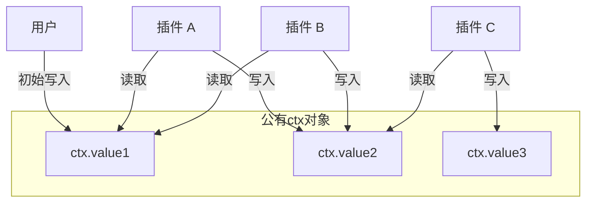

# 插件(Plugin)是什么

在此项目中，插件是一个最小的功能单元，它可以通过组合来构建更复杂的功能。

在任务中，会为插件创建一个公有的上下文对象，我们称为Context，也称ctx。插件可以通过这个上下文对象来读写数据。插件之间可以通过上下文对象进行数据传递和共享。

插件可以通过使用diamond-shovel api，来并发读取或阻塞读取某一个或多个ctx value，从而实现插件的阻塞与并发执行。

插件在读取某个ctx value后，插件应当有适合的返回值，它的返回值可以是任意对象，也可以为空，返回值应当重新写入到ctx中，可参考下图例:

