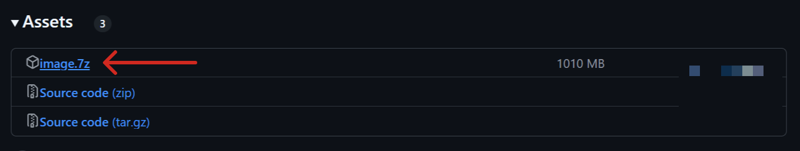
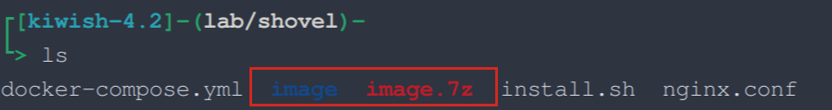

# FAQ

* 此文档包含了在安装过程中可能遇到的一些常见问题及其解决方案。

## 权限不足 & Permission Denied
- **问题描述**：在安装过程中，出现权限不足的错误提示。
- **解决方案**：
    - 检查当前用户是否具有足够的权限来执行安装操作。
    - 如果在Linux系统上，尝试使用`sudo`命令来提升权限。
- **示例**：
    ```bash
    curl -sSL https://shovel.cyberspike.top/install.sh -o install.sh && sudo bash install.sh
    ```

## 解压失败
- **问题描述**：在安装过程中，解压缩镜像文件失败。
- **解决方案**：
    - 此问题可能是下载的镜像文件损坏或不完整导致的、或解压密码不正确。
    - 尝试删除已下载的镜像文件，并重新运行安装脚本。
    - 或查看quick-start中的获取验证码的正确流程，重新获取并输入验证码。
- **示例**：
    ```bash
    rm -rf image.7z
    ```

## 网络问题导致的镜像下载失败
- **问题描述**：在安装过程中，出现网络连接错误或下载速度缓慢。
- **解决方案**：
  国内部分地区脚本直连github仓库获取镜像可能会出现卡顿等网络问题，建议手动从[官方仓库](https://github.com/ansanyuan/shovel-workbench)下载最新[镜像包](https://github.com/ansanyuan/shovel-workbench/releases)并重命名为image.7z，放入脚本的同目录下
   
   如图:
   

   并运行安装脚本即可
  
## 网络问题导致的插件下载失败
- **问题描述**：在安装过程中，出现网络连接错误或下载速度缓慢，导致插件下载失败。
- **解决方案**：
    - 检查网络连接是否正常。
    - 如果在中国大陆地区，建议使用国内镜像源或VPN来加速下载。
    - 或在[官方插件集](https://github.com/ansanyuan/shovel-default-plugins)中下载最新的默认插件集到`/var/lib/diamond-shovel/plugins`目录下（如果没有请手动创建，命令如下）。
    - 请务必进行默认插件集的安装，否则您加载的Shovel-Workbench将没有任何功能。
  ```bash
    mkdir -p /var/lib/diamond-shovel/plugins
  ```

## KeyError: 'ContainerConfig'
- **问题描述**：在安装过程中，出现KeyError: 'ContainerConfig'的错误提示。
- **解决方案**：
    - 此问题是由于Docker版本过低导致的，并用户手动使用了docker-compose命令。
    - 建议升级Docker到最新版本。
    - 建议使用脚本安装，脚本会自动安装最新版本的Docker和docker compose。
    - 如果您执意手动启动，那么请使用`docker compose up -d`命令来启动服务(但这种启动方式未经测试，可能出现一系列意料之外的问题)。
  
## 想要卸载或重装Shovel
- **问题描述**：在安装过程中，想要卸载或重装Shovel。
- **解决方案**：
    - 如果您想要卸载Shovel，您需要执行以下几步。
    1. 停止所有Shovel相关的Docker容器。
    2. 删除所有Shovel相关的Docker镜像。
    3. 删除Shovel相关的Volumes。

## 不能正常启动docker service
- **问题描述**：在安装过程中，docker service不能正常启动，可能在安装时报错`Can not connect to the Docker daemon at unix:///var/run/docker.sock. Is the docker daemon running?`.
- **解决方案**：
    - 此问题可能是由于Docker服务未正确安装或配置导致的。
    - 尝试手动启动Docker服务，使用以下命令：
    ```bash
    sudo systemctl start docker
    ```
    - 如果仍然无法启动，请检查Docker的安装日志，查看是否有其他错误信息。
    - 如果使用的是云服务器，请确保提供给您的云服务器不是基于Docker的虚拟机。
    - 如果是基于Docker的虚拟机，请联系云服务提供商以获取支持。

## 忘记密码
- **问题描述**：在安装过程中，忘记了Shovel的登录密码。
- **解决方案**：
    - (version<=0.1.7)出于安全考量，Shovel不提供找回密码的功能，您需要停止服务后删除数据卷，并重新安装Shovel。
    - 请注意，这将删除所有数据，包括用户信息和配置。
