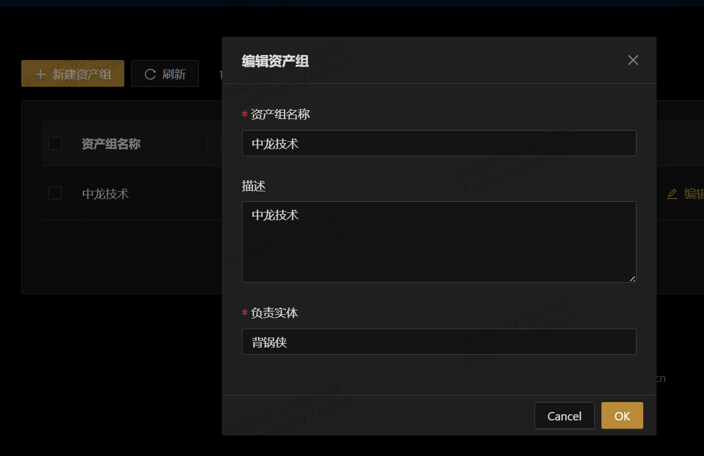
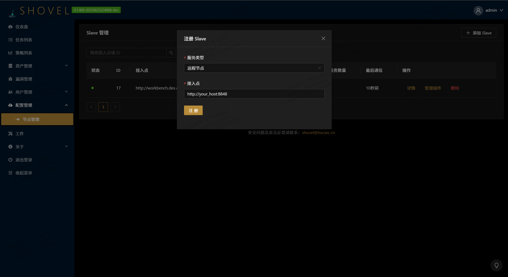
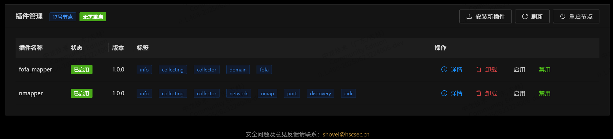
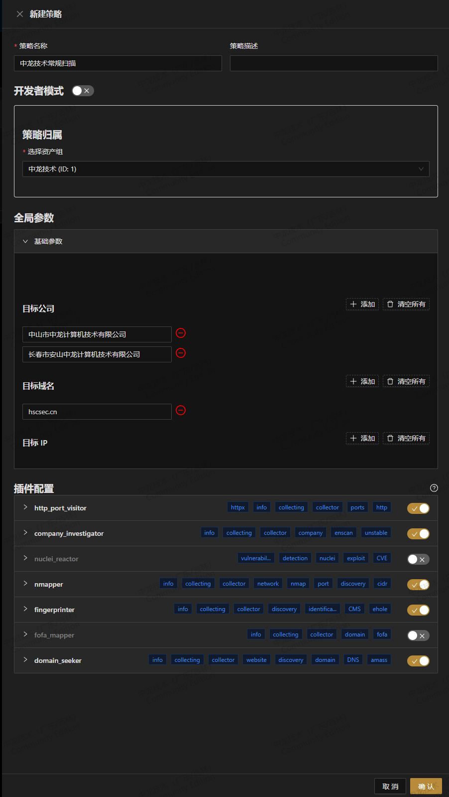
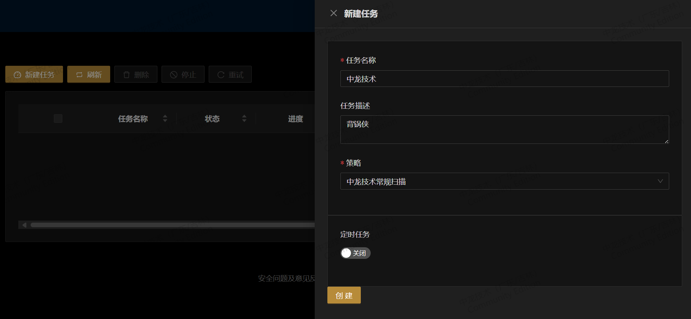
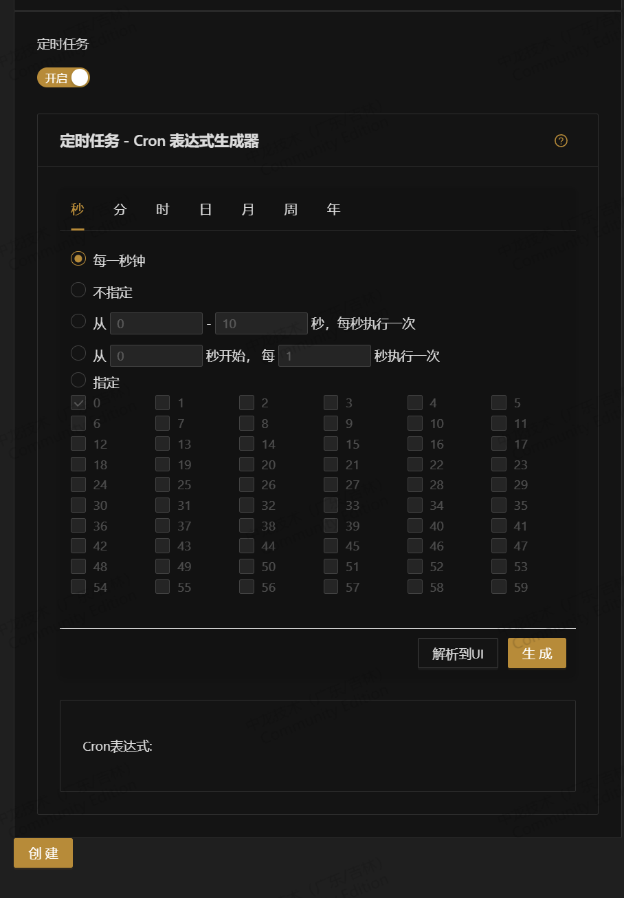

## 🚀 Shovel 快速部署指南

### 环境准备
✅ **最低配置要求**  
|配置项|最低要求|推荐配置|
|---|---|---|
|操作系统|Ubuntu 20.04+/CentOS 7+|Ubuntu 22.04/CentOS 8+|
|内存|8GB+|16GB+|
|磁盘|40GB+ 可用空间|100GB+ 可用空间|
|网络|开放80端口|稳定公网IP|

---

### 一键部署

1. Workbench

   ```bash
   curl -sSL https://shovel.cyberspike.top/install.sh -o install.sh && bash install.sh
   ```

2. 节点

   请参考[diamond-shovel](https://github.com/diamond-shovel/diamond-shovel)中的部署方法，即
   ```bash
   pip install diamond-shovel
   diamond-shovel -I
   diamond-shovel -D
   ```

---

## 📲 验证码获取流程

当出现以下提示时：  

```
请输入镜像激活码：
```

1. 访问公众号 中龙技术
2. 发送关键词 **SHOVEL-ACTIVATE**  
3. 获取验证码

---

## ⚙️ 自定义配置（可选）

### 设置管理员密码


---

## 🎉 部署完成验证

1. 访问控制台  
   `http://<你的服务器IP>`

2. 登录验证  

   ```
   默认账号：admin
   初始密码：安装过程中设置的密码
   ```

---

## 🚨 常见问题排查

详见[FAQ](FAQ/stages/install/FAQ_install.md)

## 正式开始您的shovel之旅

Shovel 创新地引入了资产组和策略，让工作更加高效便捷，所以让我们从新建资产组开始，想了解更多请详阅概念页。

1. **创建资产组和负责实体：** 将相关资产分组，并指定负责实体以便管理。
   


2. **注册节点：** 在配置管理 -> 节点管理中注册节点并安装插件。

   添加Slave:

   

   在Slave中添加插件并重启Slave:

   
      

3. **创建策略：** 选择目标资产组，并根据场景配置不同插件，可以批量导入，直接粘贴进多行ip或域名即可。

   


   
4. **开始任务：** 选择策略即可开始任务，也可手动导入和管理资产。

   

   

5. **定时任务（可选）：** 在任务菜单中创建定时任务，实现自动化操作。

   
