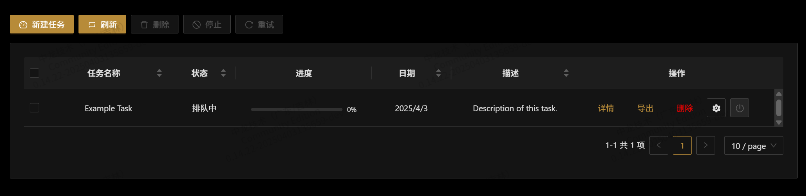
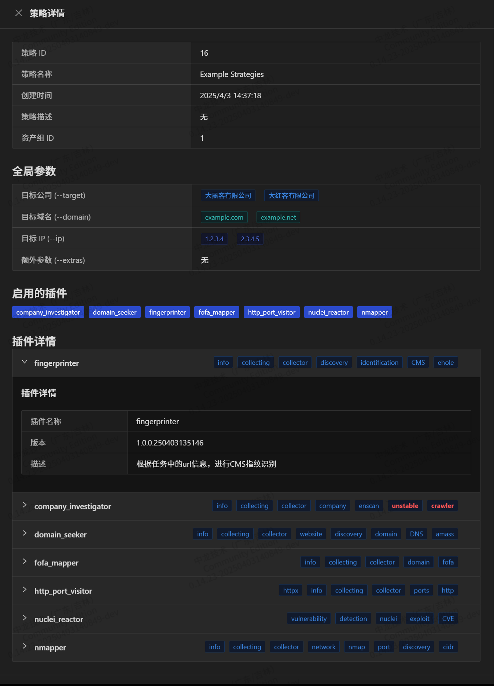
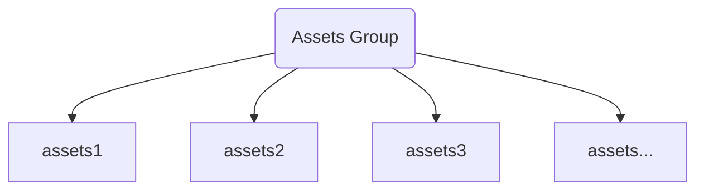
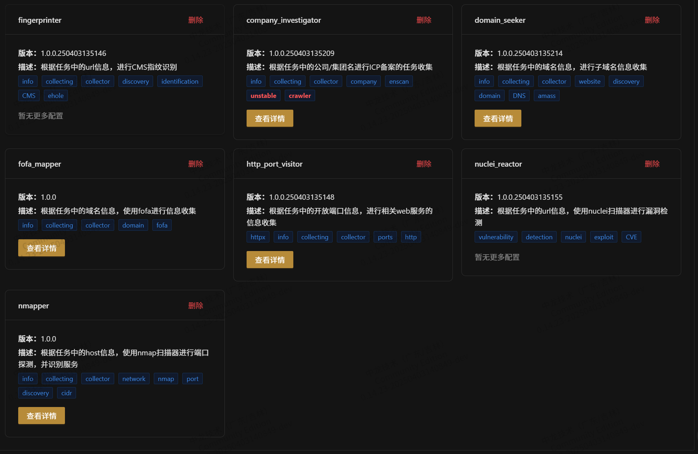
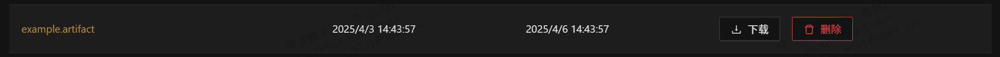
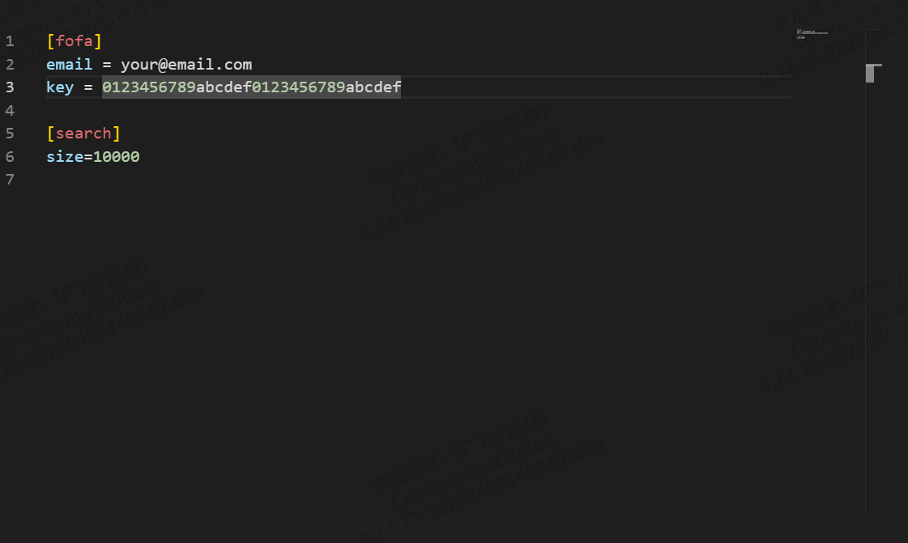
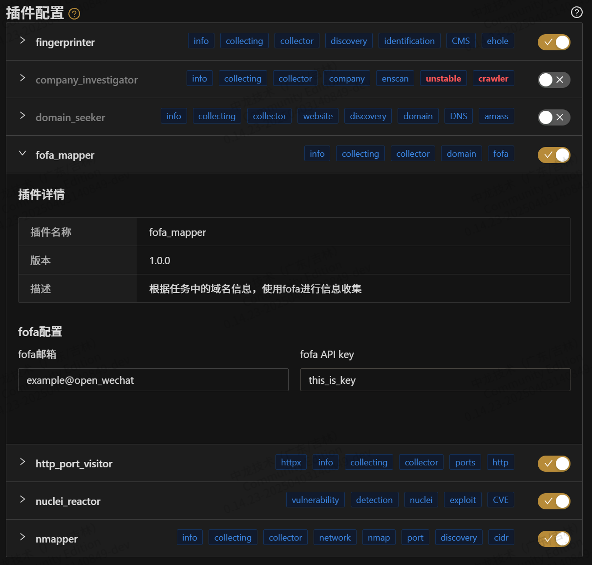

# Shovel 中间层

- `shovel-intermediate-layer`后续可能更名为`shovel-master`、`shovel-core`后续可能更名为`shovel-slave`
- `shovel-intermediate-layer` 起到**管理用户与数据库**、**调度shovel-core**、**对接用户侧**的功能
- 项目结构请参考[Project Structure](https://diamond-shovel.github.io/shovel-wiki/#/?id=%f0%9f%93%95-%e9%a1%b9%e7%9b%ae%e7%bb%93%e6%9e%84)

# 用户侧核心组件

- 处于安全考量，中间层的源代码和维护由开发团队进行闭源管理，所以中间层只在此文档中展示**用户所关注的功能组件(用户侧功能)**

## Task(任务)



任务系统是 Shovel 中间层的核心控制模块，负责管理 `shovel-cores` 的全生命周期：

- **生命周期管理**：支持动态启动/停止 `shovel-core` 实例，实时监控任务状态（运行中/已停止/异常终止）
- **操作接口**：提供标准的任务控制操作（启动、暂停、终止），支持通过 API 或 CLI 触发
- **结果处理**：支持结果导出与自动入库。
- **定时任务**：集成 Cron 表达式解析器，支持周期性任务调度（如每日凌晨全量扫描）
- **依赖管理**：自动处理任务间的依赖关系，确保执行顺序符合业务逻辑

## Strategies(策略)



策略模块定义了任务执行的业务逻辑输入：

- **输入控制**：实际业务参数（如扫描目标、认证凭证、超时阈值）通过策略配置注入任务
- **动态适配**：支持通过策略模板快速生成标准化配置（如 OWASP Top10 扫描策略模板）
- **版本管理**：提供策略版本控制功能，支持回滚到历史配置版本
- **安全隔离**：策略配置与核心执行引擎解耦，通过沙箱机制确保安全性
- **扩展规范**：具体实现参考 [Shovel Plugins 文档](docs/shovel-plugins.md)

### 基础参数

为了方便，Shovel 将可能的参数输入分为几大类，希望能覆盖所有的用户需求 (可能会在新的版本中进行调整)

* **目标公司**(`companies`)
  目标公司是指您要扫描的目标公司，您可以在这里选择一个或多个公司进行扫描，请输入公司（集团）名称。
* **目标域名**(`domains`)
  目标域名是指您要扫描的目标域名，您可以在这里输入一个或多个**主域名**进行扫描，请输入域名（如：example.com）。
  **请注意:** 为了符合最佳实践，建议域名仅包含主域名，不要包含子域名（如：www.example.com），在编写插件时也请遵循此规范。
* **目标IP**(`ips`)
  目标IP是您要扫描的目标IP，您可以在这里输入一个或多个**IPV4**进行扫描(IPV6在version<=0.1.7没有经过测试)。

## AssetsGroup(资产组)

.png)



资产组模块实现严格的资产管理规范：

- **强制归属**：所有资产（IP/域名/WEB/服务等）必须归属于某个资产组
- **权限边界**：通过资产组划分实现权限隔离（如部门级/项目级资产分组）
- **资产结构保障**：系统禁止创建任何未绑定资产组的孤立资产(悬空资产)

## Plugins(插件)



中间层的所有业务功能均由插件实现，具体请查看[shovel-plugin](docs/shovel-plugins.md)文档

## Artifacts(工件)



此工件系统为shovel内部的文件管理机制，所有的中间层的中间产物以及结果都会在这里暂存 / 永久存储，您可以在其中查询到历史的数据。


## Config(配置)





目前配置可以在策略配置中`手动设置`，也可以在配置管理中编辑`config.ini`文件

* 如果存在某一条的参数冲突，优先级高的参数会被任务使用。

* 优先级: `手动设置的参数` > `config.ini中的参数` > `空的参数`

### 举例
```ini
# config.ini
[setting]
param_1 = 1
param_2 = 2
param_3 = 
param_4 = 
```

```ini
# 手动设置的内容
[setting]
param_1 = 
param_2 = 0
param_3 = 3
param_4 = 
```
最终结果为
```ini
[setting]
param_1 = 1
param_2 = 0
param_3 = 3
param_4 = 
```