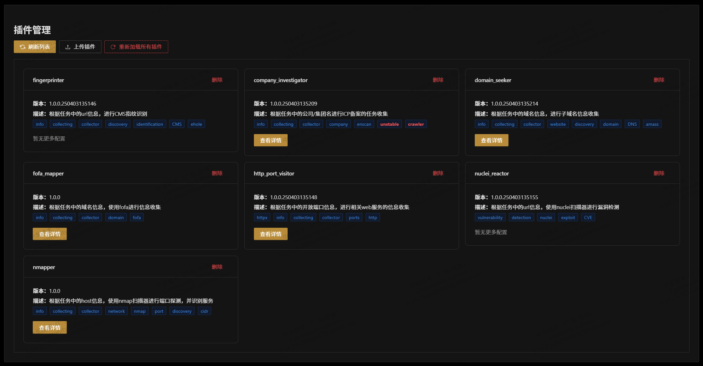
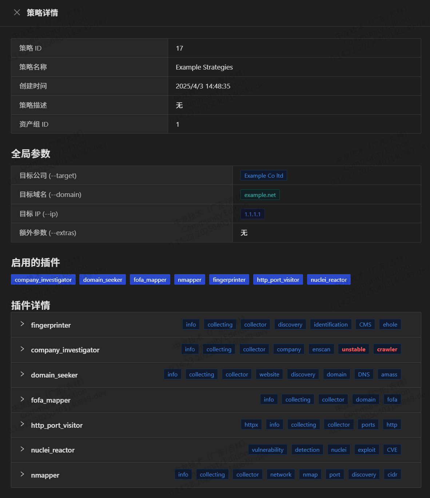
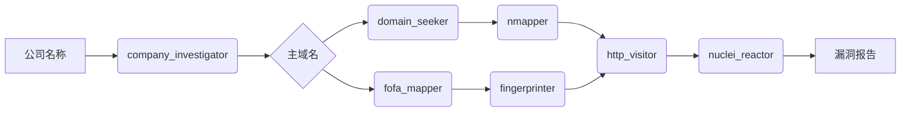
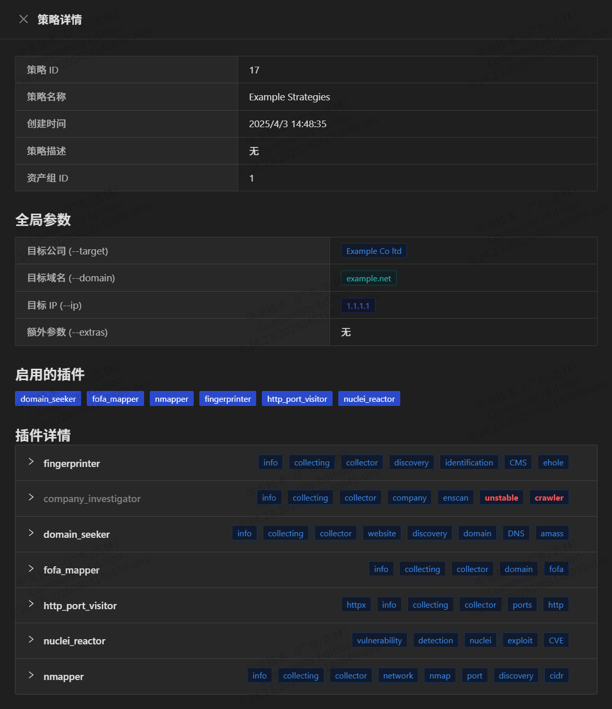
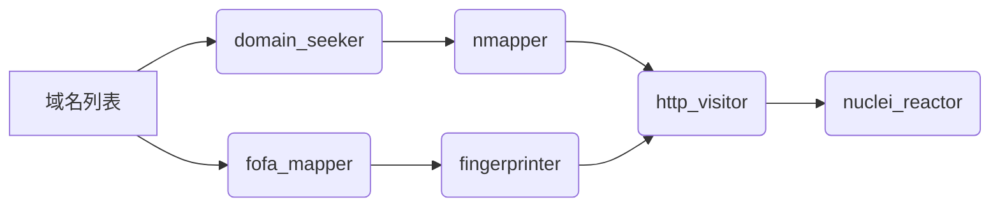
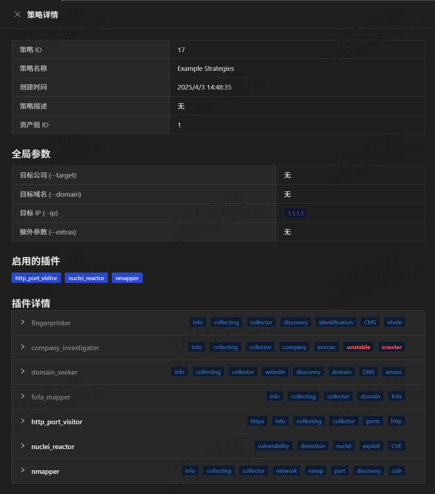
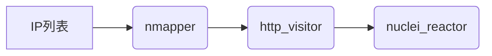

# Shovel 插件组合原理简述与使用指南

shovel-plugins系统有极高的灵活度和性能，可根据不同的input & output可以自动组合不同的流水线，采用异步架构，支持异步运行不同的 **非阻塞插件** 。

## 作为用户，我需要做什么

用户需要通过控制插件的开关以构建不同的流水线实现不同的功能。

(此项目正在积极更新中，后续可能对此包装并优化)

## 插件工作流设计原理

Shovel 采用 **模块化流水线架构** ，通过插件组合实现从资产发现到漏洞检测的完整生命周期。插件的输入和输出均放在`context`中进行上下文共享，每个插件接收上游输出作为输入，经过处理后传递给下游插件，形成可定制的工作链，官方插件集仅实现了基础的功能，若想增加自己的插件请查看文档 [plugin-dev.md](https://github.com/diamond-shovel/diamond-shovel/blob/main/docs/plugin-dev.md) [diamond-shovel](https://github.com/diamond-shovel/diamond-shovel)

## 官方插件集 INPUT & OUTPUT

公司名List -> `company_investigator`-> 主域名List

主域名List -> `domain_seeker`  -> 子域名List

主域名List -> `fofa_mapper` -> 子域名List + URLList

URLList -> `fingerprinter` -> 带指纹识别的WEBList

子域名List -> `nmapper` -> 开放端口List

开放端口List -> `http_port_visitor` -> WEBList

WEBList -> `nuclei_reactor` -> VulnList
   
## 结果持久化机制

1. **数据库写入**：
   - 数据库的结果由[中间层(shovel-intermediate-layer)](https://diamond-shovel.github.io/shovel-wiki/#/README?id=%f0%9f%93%95-%e9%a1%b9%e7%9b%ae%e7%bb%93%e6%9e%84)管控，目前(2025-04-02)默认从`http_port_visitor:worker.handle_task`中获取WEB资产结果并入库，从`nuclei_reactor:worker.handle_task` 中获取漏洞扫描结果并入库(截止到今天2025-04-02，后续可能重构数据库入库机制)。
2. **中间产物保留**：
所有插件的原始输出（如子域名列表、端口扫描结果）均会完整保存，支持：
   - 单次任务结果导出
   - 历史数据回溯分析(可在 **工件** 系统中找到对应的json原始数据以及导出过的表格数据)

## 典型应用场景（举例）

**以下仅为基于现有(2025-04-03)的官方插件集的基础功能举例**

### 场景1：从公司名到漏洞检测

开启: `company_investigator` `domain_seeker` `fofa_mapper` `nmapper` `fingerprinter` `http_visitor` `nuclei_reactor`

### 场景2：直接域名输入

开启: `domain_seeker` `fofa_mapper` `nmapper` `fingerprinter` `http_visitor` `nuclei_reactor`

### 场景3：IP地址快速检测

开启: `nmapper` `http_visitor` `nuclei_reactor`

通过灵活组合插件，您可以在10秒内构建出适应不同业务场景的安全分析流水线。所有插件均支持热插拔，建议从基础链路开始逐步扩展复杂度。
